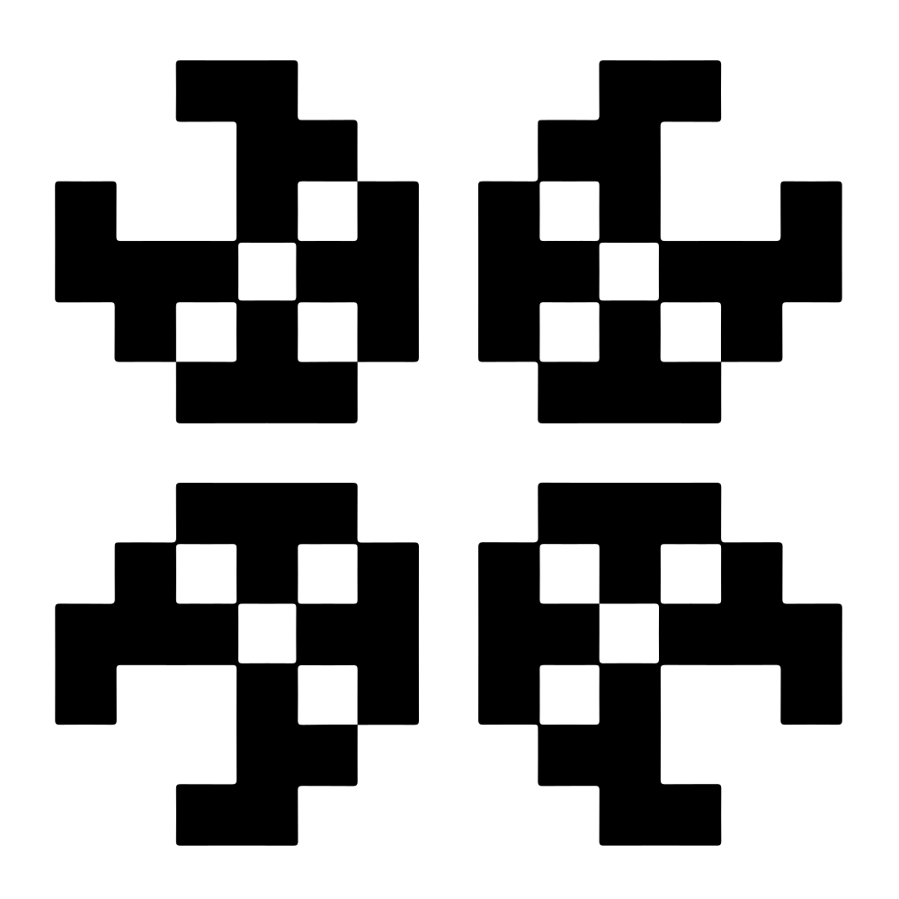

<p align="center">
    
</p>
<h1 align="center" class='title'>Game  of Life</h1>
<div align="center">

[Conway's Game of Life](https://www.conwaylife.com/) made with [React](https://reactjs.org/). 

Demo [here](https://life.carbonyl.io).

</div>

## Screencasts
### [*Pentadecathlon*](https://www.conwaylife.com/wiki/Pentadecathlon)

### Drawing


## Deployment

- Clone the project

```bash
git clone https://github.com/HITGIF/Game-of-Life.git
```

- Install and run:

```bash
npm install
npm start
```

- Open [http://localhost:3000](http://localhost:3000) to view it in the browser.

## License

This project is licensed under the terms of the [MIT license](/LICENSE).

<style>
.logo {
    width: 192px;
    height: 192px;
    margin: 12px;
}
.title {
    font-family: Fipps; 
    font-size: 40px;
    margin: 16px;
}
@font-face {
    font-family: "Fipps";
    src: url("src/fonts/Fipps-Regular.otf");
}
</style>
